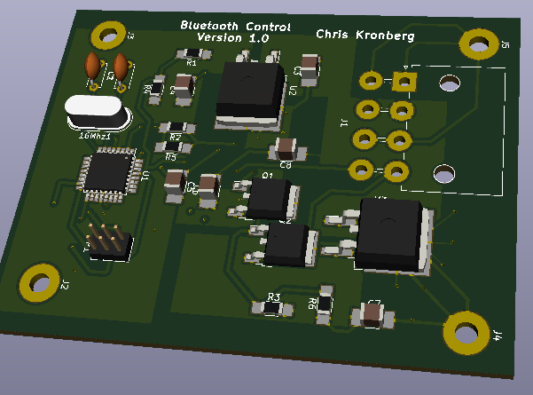

# Chris Kronberg GitHub

## Welcome
Welcome to my github site! Here I put all of my programming and electronics projects I am currently working on and projects I have worked on in the past. You are welcome to use them for reference if you would like to learn more about any of the programming languages that I have programmed here. I also welcome feedback for how to make my code better. I have been to IUPUI for a minor in CS and am currently at Eleven Fifty Academy working on a C# .net MVC project. I will be looking for a job in Software Development or electronics engineering in the third week of July 2021.

## Interests
Electronics Engineering and Programming in C, C++, Python, and C#  

## Currently Learning
C#  .Net Web MVC

## How to Contact
**Email:** ckronber@gmail.com  
**Phone:** 812-521-0342 
## Eleven Fifty Academy Projects

### 1. Gold Badge Projects
- Web Page
- CSS Creature
- Console Apps
### 2. BFG Coffee Shop 
- Created a coffeeshop webApi to have a customer add items to the order and computed total price of items
- Python Console App for Accessing BFG CoffeeShop Web Api
<!---
ckronber/ckronber is a ✨ special ✨ repository because its `README.md` (this file) appears on your GitHub profile.
You can click the Preview link to take a look at your changes.
--->
